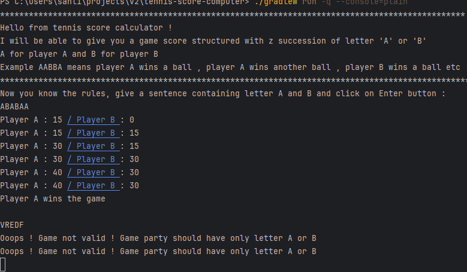
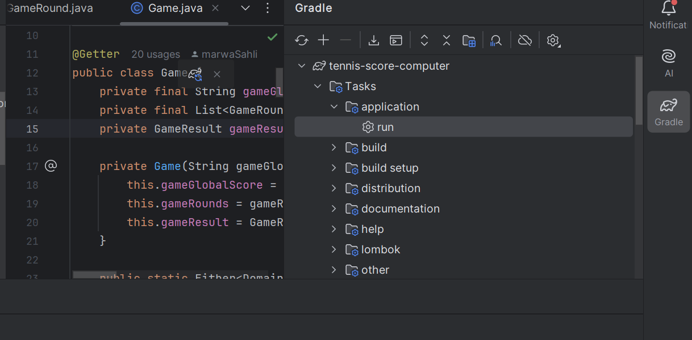

# Tennis Score Computer

This is an implementation of a simple tennis score computer.

The scoring system consist in one game, divided by points :

- Each player starts a game with 0 point.
- If the player wins the 1st ball, he will have 15 points. 2nd balls won : 30 points. 3rd ball won : 40points.
- If a player have 40 points and wins the ball, he wins the game, however there are special rules.
- If both players have 40 points the players are “deuce”.
- If the game is in deuce, the winner of the ball will have advantage
- If the player with advantage wins the ball he wins the game.
- If the player without advantage wins the ball they are back at “deuce”.


This program take a String as input containing the character ‘A’ or ‘B’. 

The character ‘A’ corresponding to “player A won the ball”, and ‘B’ corresponding to “player B won the ball”.

This program prints the score after each won ball (for example : “Player A : 15 / Player B : 30”) and print the winner of the game.
## Example

The following input “ABABAA” should print :

“Player A : 15 / Player B : 0”

“Player A : 15 / Player B : 15”

“Player A : 30 / Player B : 15”

“Player A : 30 / Player B : 30”

“Player A : 40 / Player B : 30”

“Player A wins the game”


## Building and Running 
It's supposed that you have Java 21 on your computer !

To build project,  run this command from the project's root:
```sh
 ./gradlew build 
 ```

To run application, run this command from the project's root:
```sh
 ./gradlew run -q --console=plain 
 ```
This is an example of the console's output:



you can run the project directly from your editor , image below shows how to run it on IntelliJ



## License

**Free Software, Yeah!**

